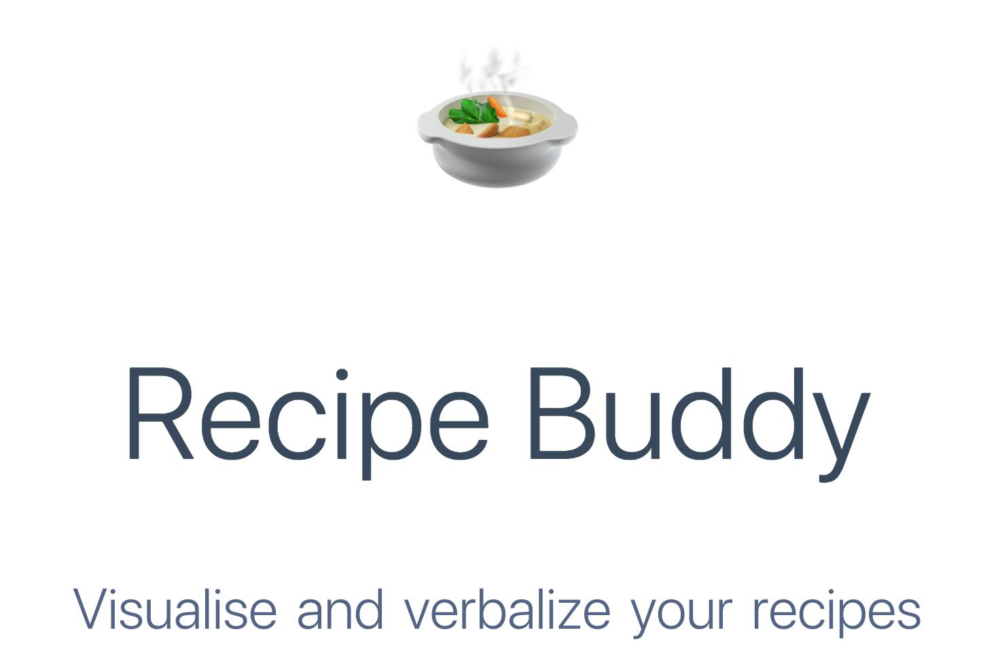
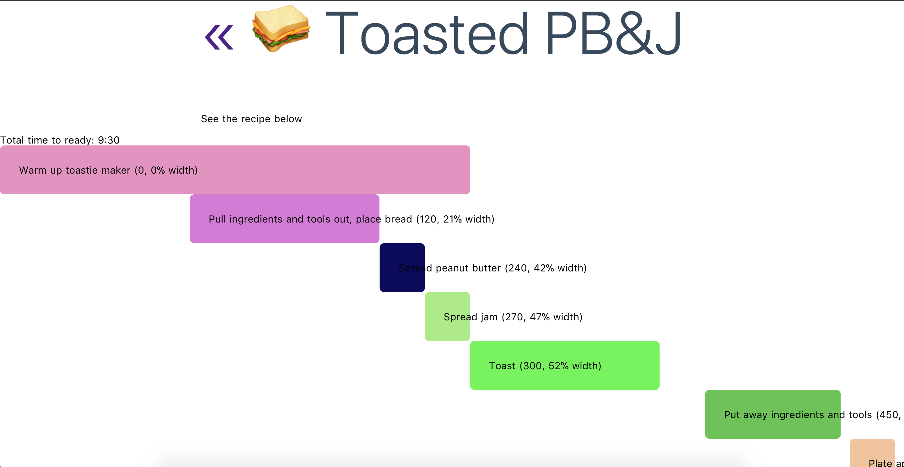

# recipe-buddy

> Visualise and verbalize your recipes



[See About page component for details.](./pages/about.vue)

## Current state and next steps

**Now:** A static representation of a recipe layout

**Next:**

- Chart background with minute marks
- Make recipe tasks editable (add/edit/remove tasks)
- Make ability to add/edit/remove recipes
- Add ability to drag to change task duration and offset
- Add voice assistant features?

[See About page component for other ideas and considerations.](./pages/about.vue)

## Build Setup

``` bash
# install dependencies
$ npm install # Or yarn install

# serve with hot reload at localhost:3000
$ npm run dev

# build for production and launch server
$ npm run build
$ npm start

# generate static project
$ npm run generate
```

For detailed explanation on how things work, checkout the [Nuxt.js docs](https://github.com/nuxt/nuxt.js).

## Recipe view


